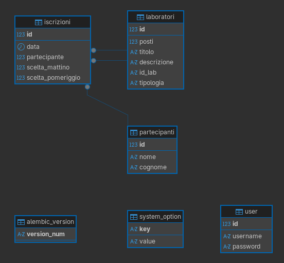

# Per Me Sei Avventura - Tool Laboratori
Tool iscrizione laboratori convegno nazionale Per Me Sei Avventura

### Schema DB



### Deploy
Docker compose: 
```yaml
services:
  web:
    image: ghcr.io/calminaro/permeseiavventura_laboratori:latest
    restart: unless-stopped
    environment:
      DB_TYPE: mariadb
      DB_USER: app_user
      DB_PASSWORD: app_password
      DB_HOST: db
      DB_PORT: 3306
      DB_NAME: app_db
      SECRET_KEY: secret_key
    depends_on:
      db:
        condition: service_healthy

  db:
    image: mariadb:11.4
    container_name: mariadb
    restart: unless-stopped
    environment:
      MARIADB_ROOT_PASSWORD: rootpassword
      MARIADB_DATABASE: app_db
      MARIADB_USER: app_user
      MARIADB_PASSWORD: app_password
      TZ: Europe/Rome
    volumes:
      - mariadb_data:/var/lib/mysql
    healthcheck:
      test: ["CMD", "mariadb-admin", "ping", "-h", "localhost", "-uroot", "-prootpassword"]
      interval: 5s
      timeout: 3s
      retries: 5

  nginx:
    image: nginx:alpine
    restart: unless-stopped
    ports:
      - "5000:80"
    volumes:
      - ./nginx.conf:/etc/nginx/nginx.conf:ro
    depends_on:
      - web

volumes:
  mariadb_data:
```
nginx.conf
```
events {}

http {
    upstream backend {
        server web:8000;
    }

    server {
        listen 80;

        location / {
            proxy_pass http://backend;
            proxy_set_header Host $host;
            proxy_set_header X-Real-IP $remote_addr;
            proxy_set_header X-Forwarded-For $proxy_add_x_forwarded_for;
            proxy_set_header X-Forwarded-Proto $scheme;
        }
    }
}
```